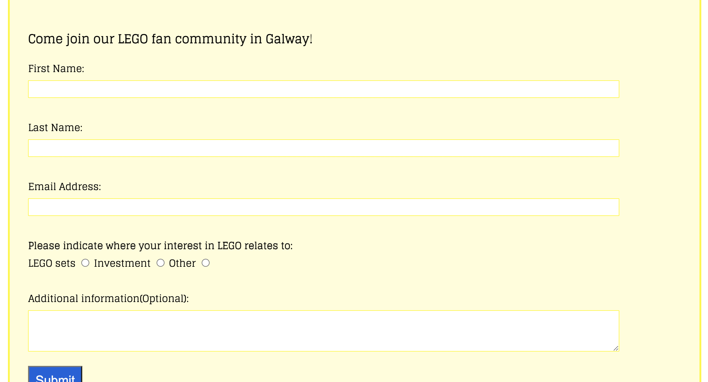
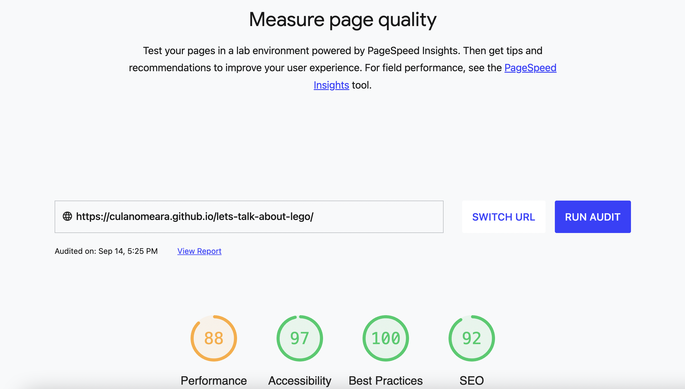

# Let's Talk About Lego

This site is for those that are curious about LEGO and specifically for those that are curious about why a middle-aged man would love it so much. I will walk you through my life in LEGO. The site will give the user a whistlestop tour of the most significant/memorable LEGO sets I own from childhood to now and hopefully give them a sense of the lifelong appeal of LEGO. Enjoy the journey...

## Features 

- The site has a clear title that gives the user an instant sense of what the website is about: My life and love of LEGO.
- The banner/hero image further reinforces the LEGO theme.
- The font used is a block-type font that reflects the building block: LEGO.
- Each section: Childhood, Teens and Adulthood are separate pages that highlight the 3 most significant lego sets that I owned during that time period. The Contact page give the user an opportunity to join the LEGO fan club in Galway.
- The social links to the LEGO group socials offers the user the opportunity to delve deeper into the world of LEGO.

### Existing Features

- __Navigation Bar__

  - Featured at top of the page, the full responsive navigation bar includes links to the Home page, Childhood section, Teen section, Adulthood sections and to Contact page to allow for easy navigation.
  - This section will allow the user to easily navigate from section to section, page to page across all devices without having to revert back to the previous page via the ‘back’ button.

- __The Hamburger__

- When screens get below 600px, the nav bar will collapse into a hamburger menu(except for HOME link). If clicked, the hamburger will give the user the nav menu vertically to avoid display issues and be more user-friendly.

- When the user clicks on the hamburger it opens vertically.

- __Childhood section__

  - The Childhood section will allow the user to find out about the 3 sets that I found memorable during my childhood. 
  - The idea of this is to bring some nostalgia and pique the users interest in LEGO and want to find out more

- __Teens section__

  - The Teens section will allow the user to find out about the 3 sets that I found memorable during my teenage years. 
  - The idea of this is to move the use through this period and see how my interests(and possibly theirs) changes over time.

- __Adulthood section__

  - The Adulthood section will allow the user to find out about the 3 sets that I found memorable during my current phase of life: Adulthood. 
  - The idea of this is to bring us right up-to-date with LEGO sets and show the diversity of sets that exist out there and to hook them into following my passion of LEGO

- __Contact page__

  - This page gives the user the opportunity to contact me and ask a question about LEGO. They will enter their first name, last name, email, and a question if they choose.
  

- __The Footer__ 

  - The footer section includes links to the relevant social media sites for The LEGO Group. The links will open to a new tab to allow easy navigation for the user. 
  - The footer is valuable to the user as it encourages them to keep connected via social media to the LEGO group.

## Testing 

- I have tested this site in various browsers: Chrome, Safari and Firefox.
- I have tested the site to ensure that it is responsive and maintains it's structure and integrity with various screen sizes and devices.(mobile/tablet/laptop/desktop)
- I have confirmed with users that the text is easy to read and the navigation menu easy to use.
- I have checked that the contact form works and ensured that required fields work as intended and that the form validates the input.

### Validator Testing 

- HTML
  - No errors were returned when passing through the official W3C Validator
    - [Index](https://validator.w3.org/nu/?doc=https%3A%2F%2Fculanomeara.github.io%2Flets-talk-about-lego%2Findex.html)
    - [Childhood](https://validator.w3.org/nu/?doc=https%3A%2F%2Fculanomeara.github.io%2Flets-talk-about-lego%2Fchildhood.html)
    - [Teens](https://validator.w3.org/nu/?doc=https%3A%2F%2Fculanomeara.github.io%2Flets-talk-about-lego%2Fteens.html)
    - [Adulthood](https://validator.w3.org/nu/?doc=https%3A%2F%2Fculanomeara.github.io%2Flets-talk-about-lego%2Fadulthood.html)
    - [Contact](https://validator.w3.org/nu/?doc=https%3A%2F%2Fculanomeara.github.io%2Flets-talk-about-lego%2Fcontact.html)
    
- CSS
  - No errors were found when passing through the official [(Jigsaw) validator](https://jigsaw.w3.org/css-validator/validator?uri=https%3A%2F%2Fculanomeara.github.io%2Flets-talk-about-lego%2F&profile=css3svg&usermedium=all&warning=1&vextwarning=&lang=en)

### Fixed Bugs

- I had a number of bugs that I worked thru:
  - Errors with filepaths when deployed to Github. this was resolved when i moved away from absolute filepaths.
  - When the screen was small, the nav menu got distorted. This was solved by introducing a hamburger menu feature(suggested by my mentor).
  - The site title was too large when the screen was small so i changed from px to relative width values.
  - Many typos in readme.md
  - Text sitting too close to right side of screen. Added padding to paragraphs.
  - Hamburger menu text got too small on mobile screens. Adjusted text size.
  - validation error with stray script outside body. moved it inside.
  - vaildation error with javascript having alt tag. Tag was removed.

## Deployment 
### Cloning and Forking
- To CLONE: 
  - Navigate to the repository: [Let's Talk About Lego](https://github.com/culanomeara/lets-talk-about-lego)
  - Above the list of files, click Code.
  - Copy the URL for the repository.
  - Open Terminal and change to the new directory where you want the cloned files to go
  - type git clone and paste in the copied url from the repository

- To FORK:
  - Navigate to the repository: [Let's Talk About Lego](https://github.com/culanomeara/lets-talk-about-lego)
  - At top of page, click on FORK
  - Select the owner, name and description for the new fork.
  - Select which branches you want to fork.
  - Create fork.

### Remote
- The site was deployed to GitHub pages. The steps to deploy are as follows: 
  - In the GitHub repository, click on the Settings icon 
  - On the left-hand menu, click on Pages
  - From the options that appear, select Deploy from branch, then select MAIN
  - Once you save those changes, the site goes live. It takes about 10 mins before you can see the live site.

The live link can be found here - https://culanomeara.github.io/lets-talk-about-lego/ 

## Credits 

### Content 

- Text is all my own
- Hero image and outer styling and concept inspired by [Code Institute-Love Running](https://github.com/Code-Institute-Solutions/love-running-2.0-sourcecode/blob/main/03-creating-the-hero-image/03-hero-image-cover-text/assets/css/style.css)
- Grid Layout code was inspired by [gridbyexample](https://gridbyexample.com/examples/example13/)
- Thumbnail images and border style inspired by [Study Tonight](https://www.studytonight.com/css-howtos/how-to-create-a-thumbnail-image-with-css)
- Hamburger menu [W3School](https://www.w3schools.com/howto/howto_js_topnav_responsive.asp)
- Instructions on how to implement form validation on the Sign Up page was taken from [Specific YouTube Tutorial](https://www.youtube.com/)
- Color Palette is from [Coolors.co](https://coolors.co/e30022-fff600-4cbb17-0063dc-ff681f)
- The icons in the footer were taken from [Font Awesome](https://fontawesome.com/)
- The font is Glegoo from Google Fonts [Google Fonts](https://fonts.google.com/specimen/Glegoo?query=lego&sort=popularity&preview.text=My%20childhood%20sets&preview.text_type=custom#styles)

### Media

- The background LEGO wallpaper images are from [Wallpaperaccess](https://wallpaperaccess.com/lego-bricks)
- The LEGO set images are from [Brickset](https://brickset.com/)
